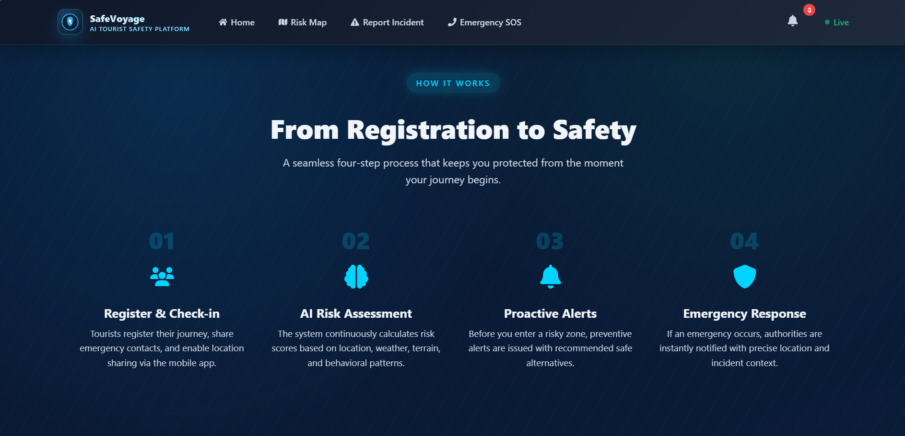
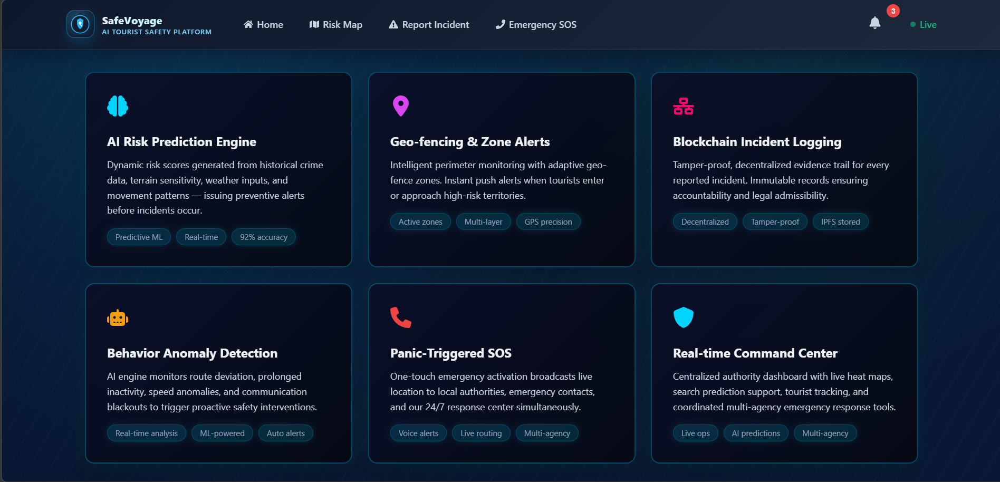
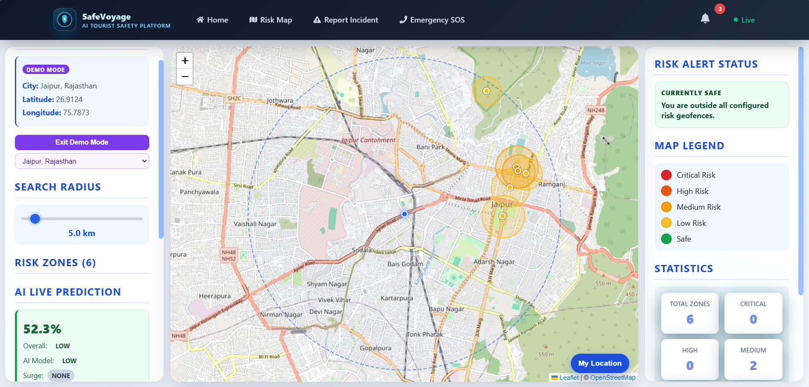
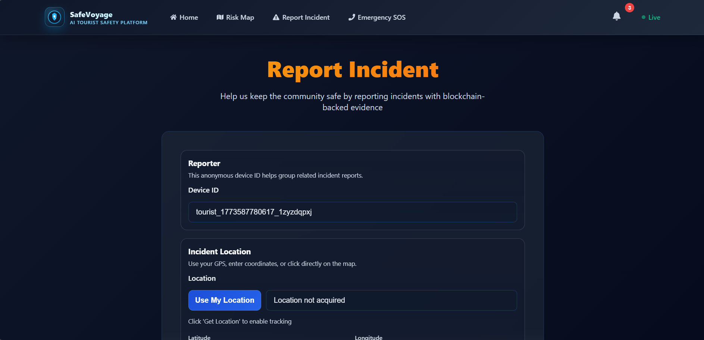
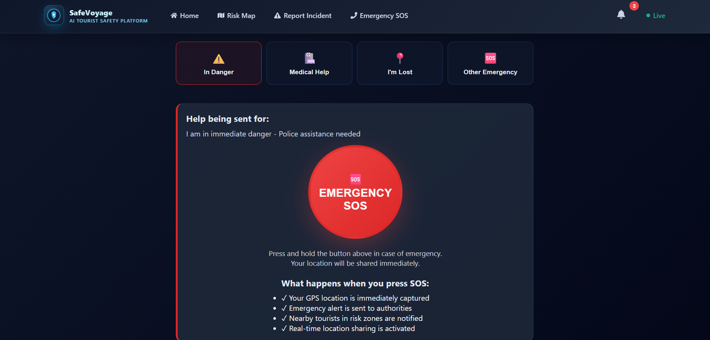
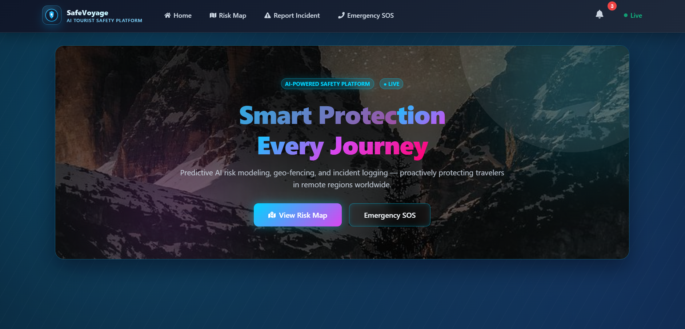
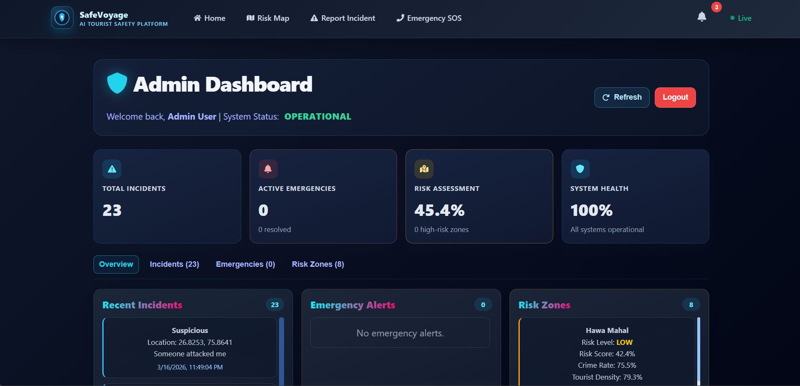

# SafeVoyage

AI-driven Tourist Safety and Emergency Management Platform.

SafeVoyage is a full-stack safety intelligence app that turns live incident reports into dynamic risk zones, geofence alerts, and AI-assisted location risk predictions.

## Live Demo
https://safe-voyage-ai-driven-tourist-safe.vercel.app

## Screenshots (3x3)
<table>
  <tr>
    <td align="center"><br/>How It Works</td>
    <td align="center"><br/>Features</td>
    <td align="center"><br/>Risk Map</td>
  </tr>
  <tr>
    <td align="center"><br/>Report Incident</td>
    <td align="center"><br/>Emergency SOS</td>
    <td align="center"><br/>Admin Dashboard</td>
  </tr>
  <tr>
    <td align="center"><br/>Geofence View</td>
    <td align="center"><br/>Incident Flow</td>
    <td align="center"><br/>Admin Dashboard</td>
  </tr>
</table>

## What the App Does
- Tracks live user location on map.
- Fetches risk zones continuously and displays color-coded severity.
- Detects geofence entry and raises in-app risk alerts.
- Generates AI risk prediction for current location.
- Lets users report incidents that update risk intelligence.
- Provides emergency SOS trigger with live location capture.
- Gives admin dashboard access for emergency and risk management.
- Maintains tamper-evident incident chain with hashes.

## Core Modules
### Frontend
- React + React Router
- React Leaflet + OpenStreetMap
- Location-aware map, risk UI, incident report flow, SOS flow

### Backend
- Node.js + Express + Mongoose
- REST APIs for risk, incidents, emergency, admin
- Geofence checks and incident-driven risk updates

### AI Layer
- Python model (`model/predict.py`, `model/train_model.py`)
- Risk inference using context + engineered signals
- Score, level, and feature snapshot output

## Repository Structure
```text
.
|- backend/
|  |- server/
|  |  |- config/
|  |  |- Controllers/
|  |  |- Middlewares/
|  |  |- Models/
|  |  |- Routes/
|  |  |- utils/
|  |- createAdmin.js
|  |- seedDemo.js
|- frontend/
|  |- tourist-risk-platform/
|     |- src/
|        |- components/
|        |- pages/
|        |- services/
|- model/
|  |- train_model.py
|  |- predict.py
|- screenshots/
|- tourist_risk_dataset.csv
```

## Quick Start
## 1) Backend setup
```bash
cd backend
npm install
```

Create `backend/.env`:
```env
MONGO_URL=<your_mongodb_connection_string>
JWT_SECRET=<your_jwt_secret>
ADMIN_EMAIL=<admin_email>
ADMIN_PASSWORD=<admin_password>
SEED_DEMO_CITY=jaipur
```

Run backend:
```bash
npm run dev
```

Optional demo data and admin:
```bash
npm run seed
npm run admin:create
```

## 2) Frontend setup
```bash
cd frontend/tourist-risk-platform
npm install
```

Create `frontend/tourist-risk-platform/.env`:
```env
REACT_APP_API_URL=https://safevoyage-ai-driven-tourist-safety.onrender.com
```

Run frontend:
```bash
npm start
```

## 3) Model setup (optional retraining)
```bash
cd model
py -3 -m pip install joblib numpy pandas scikit-learn requests
py -3 train_model.py
```

## API Summary
Base URL: `/api`

- Risk
  - `GET /risk/all`
  - `POST /risk/create` (admin)
  - `POST /risk/predict`
  - `POST /risk/geofence/check`
- Incidents
  - `GET /incidents/all`
  - `POST /incidents/report`
  - `GET /incidents/verify-chain`
- Emergency
  - `GET /emergency/all`
  - `POST /emergency/panic`
- Admin
  - `POST /admin/login`
  - `PATCH /admin/emergency/:id` (admin)
  - `PATCH /admin/risk/:id` (admin)

## Current Strengths
- Incident-driven map risk updates.
- Live geofence risk awareness.
- AI + statistics hybrid risk outputs.
- Explainable response payload from prediction layer.
- Tamper-evident incident logging chain.

## License
Prototype for educational and hackathon use.
